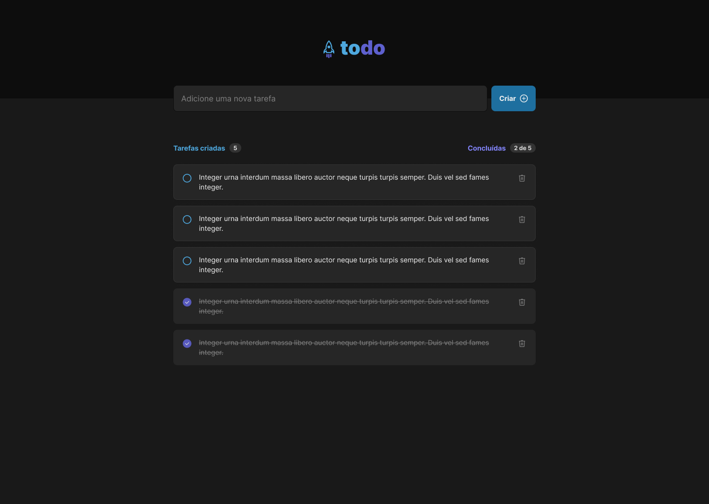

# ✅ To-Do List

Welcome to **To-Do List**, your ultimate task management tool. This project is designed to help you stay organized and productive with features like drag-and-drop task management, a clean and modern UI, and real-time state management.

---



## 🚀 Features

### Completed Features
- **Add Tasks**: Easily add new tasks with a simple and intuitive interface.
- **Edit Tasks**: Modify task details with inline editing.
- **Delete Tasks**: Remove completed or unnecessary tasks with ease.
- **Drag and Drop**: Reorganize your tasks using drag-and-drop functionality powered by `react-beautiful-dnd`.
- **Persistent State**: Tasks are stored locally using `zustand` for seamless state management.
- **Responsive Design**: Optimized for desktop, tablet, and mobile devices.


## 🛠️ Technologies Used

| Technology           | Description                                            | Icon                                                                                 |
|-----------------------|--------------------------------------------------------|-------------------------------------------------------------------------------------|
| **React.js**         | JavaScript library for building user interfaces.       |           |
| **TypeScript**       | Typed superset of JavaScript for scalable development.  |  |
| **Tailwind CSS**     | Utility-first CSS framework for modern designs.         |  |
| **Zustand**          | Lightweight state management library for React apps.    |     |
| **React Beautiful DnD** | Library for drag-and-drop interfaces in React.        |  |

---

## 📖 Getting Started

Follow these steps to get the project up and running on your local machine:

1. Clone the repository:
   ```bash
   git clone https://github.com/Adao-Angelo/todo-list.git
   ```

2. Navigate to the project directory:
   ```bash
   cd todo-list
   ```

3. Install dependencies:
   ```bash
   npm install
   ```

4. Start the development server:
   ```bash
   npm start
   ```

5. Open your browser and navigate to:
   ```
   http://localhost:5173
   ```

---

## 📧 .env Configuration

To configure the project, add a `.env` file in the root directory with the following keys:

```env
# Example .env file
REACT_APP_API_URL=your-api-url-here
REACT_APP_FEATURE_FLAG=true
```

[Detailed documentation](./docs/env.md).

---

## 📧 Contact

For questions or feedback, feel free to reach out:

- **Email**: adaobbegginer@gmail.com
- **GitHub**: [Adão Ângelo João](https://github.com/Adao-Angelo)

---

Thank you for using **To-Do List**! Stay productive and enjoy managing your tasks.

